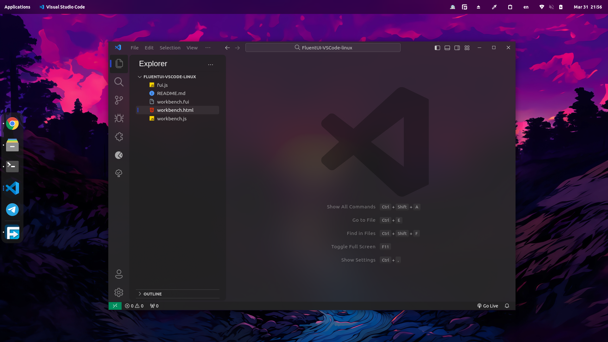
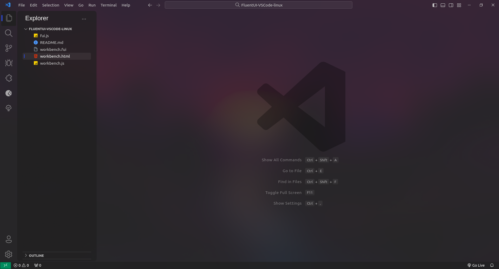
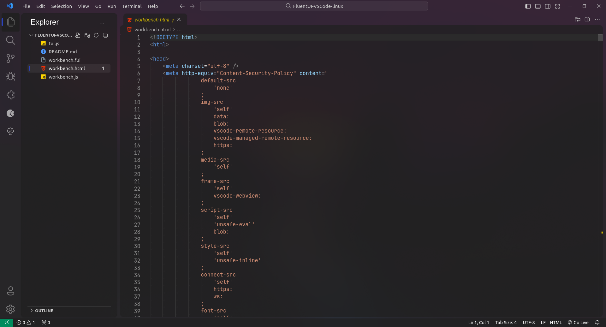

 
#  FluentUI VSCode fixed linux
 
 **replace 4 file in `sudo cp -rf fui.js workbench.fui workbench.html workbench.js /usr/share/code/resources/app/out/vs/code/electron-sandbox/workbench `**
 
 **for change wallpaper open `workbench.html` and chnage --app-bg-img: value**

 # ScreenShots

